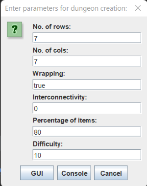
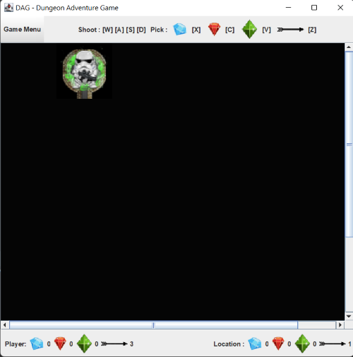
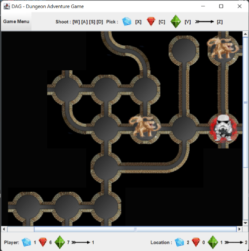

# Project 5 - Graphical Adventure Game

## About
This project consists of the model, the text-based controller, a new GUI-based controller, and a GUI view for our dungeon adventure game.

The game model takes care of the mechanics of the game world, the controller takes input through keys and mouse clicks and runs the game by displaying it on the GUI.

## List of features
- Dungeon is created in accordance with all the requirements given as arguments given by the user.
- Player can move in valid directions from each location in the cave by clicking the arrow keys or clicking one valid location away from the current player location.
- Player can pick a treasure or arrow if available in the current location using keyboard inputs.
- Player can shoot arrows in valid directions and over a given no. of caves by giving keyboard inputs and giving an integer distance when prompted by input dialog.
- The game can run in both GUI as well as console-based mode. 
- The game controller provides visual clues about the nearby locations and other relevant aspects of the current game state of the dungeon.

## How To Run

The jar file can be run by using the below syntax to bring up the game GUI:

```
java -jar PDP-P5-Graphical-Adventure-Game.jar
```
The game GUI lets the user decide if they want to play in the GUI mode or console-based mode.
\
\
\
The jar file can also be run strictly in the console-based mode by specifying all the arguments as such:
```
java -jar PDP-P5-Graphical-Adventure-Game.jar <rows> <cols> <wrapping> <interconnectivity> <percent of treasure> <difficulty>
```
For example:

```
java -jar PDP-P5-Graphical-Adventure-Game.jar 5 5 true 5 70 10
```

## How to Use the Program
The program runs interactively based on keypresses and mouse clicks.

The available set of controls for the GUI based game are : \
`Arrow up ↑` : move north \
`Arrow down ↓` : move south \
`Arrow right →` : move east \
`Arrow left ←` : move west 

`W` : shoot north \
`S` : shoot south \
`D` : shoot east \
`A` : shoot west  

To shoot, enter the shooting distance in the input dialog that is prompted by pressing shoot keys.

`Z` : pick Arrow \
`X` : pick Diamond \
`C` : pick Ruby \
`V` : pick Sapphire


After every move all the relevant visual cues required to play further moves are updated on GUI.

## Example Screenshots
1. 
2. 
3. 

## Description of Examples
1. The first image shows the start screen for the GUI which prompts the user to enter the dungeon parameters and create the model.

2. The second image shows a new game screen with no other location except start explored with faint smell.

3. The third image shows a game with partially explored dungeons with Otyughs around the player and strong smell.

In the above examples 2 and 3 you can also see on the panel below dungeon map- the player details (i.e. no. of arrows and treasure the player has) and the current location information (i.e. no. of items present in the current location).

## Design/Model Changes.
- Instead of having all the GUI components defined in the same class, I broke down the components into smaller parts and defined custom `JPanel` for all major components to give more control over the look of the UI and ease of debugging.

- The new input view that prompts the user for dungeon parameters comes up first before the actual game view.

- The GUI controller extends the old console controller instead of being an entirely different interface.


## Assumptions
- The player can only move via mouse clicks one position at a time.
- The player can pick items only one a time.

## Limitations
- The scroll bar can be made so that it automatically adjusts to the player position when the player moves so that the user doesn't have to manually scroll to find the player.
- Multi-key listeners can be used effectively to make moves like shooting more user-friendly.
- Extra features like thieves, pits, and moving stationery monsters could have been added.

## Citations
- [Menubar in Swing](https://docs.oracle.com/en/java/javase/11/docs/api/java.desktop/javax/swing/JMenu.html)

- [Grid Layout in Swing](https://docs.oracle.com/javase/tutorial/uiswing/layout/grid.html)

- [Painting custom components in Swing](https://docs.oracle.com/javase/tutorial/uiswing/painting/)